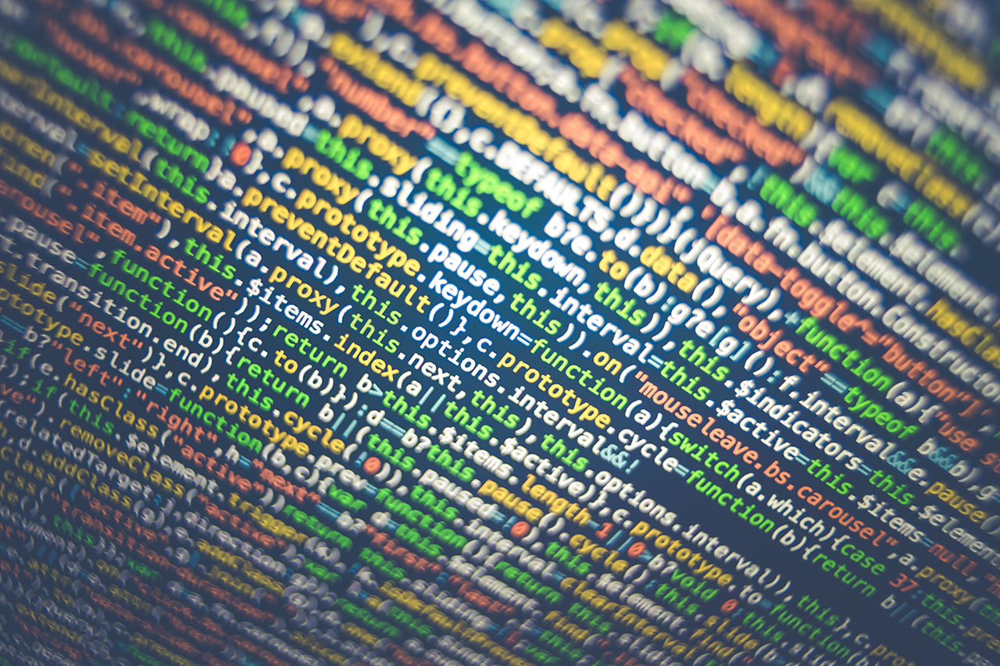

## Welcome to My Pages

This page has been created to track the progress of PHP activities set over the course of six to eight weeks for the programming portion of Web-Based Technologies.

Please note that this is for school purposes only.

----

### Week One - Introduction to PHP

The PHP that will be covered in Week One will be to get PHP configuration and information and also to display certain information using PHP.

[Week One scripts can be found here](https://jamespssmith.github.io/James-Tries-PHP/week-one)

----

### Week Two - Control Flow If/Else & Switch

The PHP that will be covered in Week Two will be Conditions and Control Flow and Switch.

[Week Two scripts can be found here](https://jamespssmith.github.io/James-Tries-PHP/week-two)

----

### Week Four - Arrays in PHP

### Week Five - Loops: For and ForEach

### Week Six - Loops: While and Do-While

### Week Seven - Functions in PHP, Part 1 & 2

### Week Eight - Object Orientated PHP, Part 1 & 2

### Week Nine - Advanced Arrays and Maps
