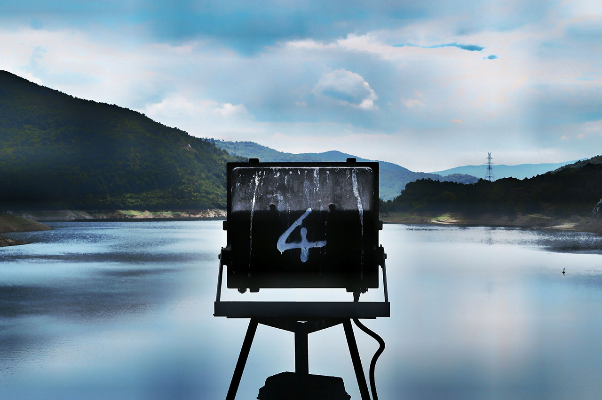

## Week Four - The Rest




Activities
------ 


* Write a function to reverse a string.

```markdown

<html>
    <head>
		<title></title>
	</head>
	<body>

<?php
echo strrev("Hello World!");
?>

	</body>
</html>

```


* Write a PHP function that checks if a string is all lowercase


```markdown

<html>
    <head>
		<title></title>
	</head>
	<body>

<?php
function is_str_lowercase($str1)
   {
    for ($sc = 0; $sc < strlen($str1); $sc++) {
	      if (ord($str1[$sc]) >= ord('A') &&
          ord($str1[$sc]) <= ord('Z')) {
      return false;
         }
         }
      return true;
       }
var_dump(is_str_lowercase('abc def ghi'));
var_dump(is_str_lowercase('abc dEf ghi'));
?>


	</body>
</html>

```


### Download files:
Right click on links to save as single-files.


<a href="https://raw.githubusercontent.com/jamespssmith/James-Tries-PHP/master/activities/activity4-1.php">4-1</a>

<a href="https://raw.githubusercontent.com/jamespssmith/James-Tries-PHP/master/activities/activity4-2.php">4-2</a>
