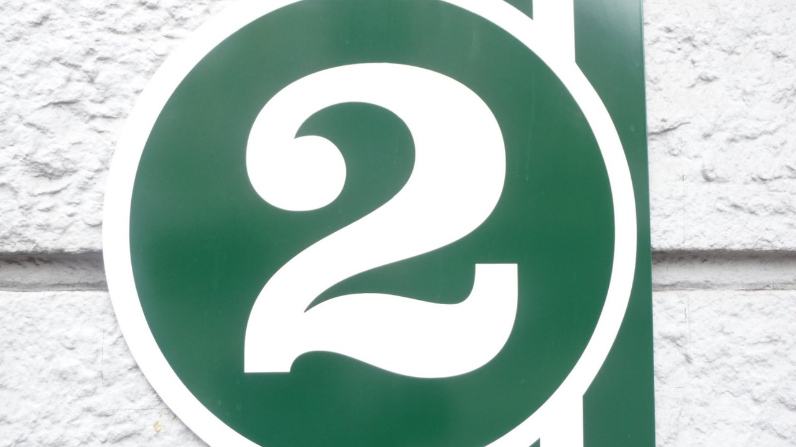

## Week Two - Control Flow If/Else & Switch




Activities
------ 


* Write a PHP function to test whether a number is greater than 30, 20 or 10 using ternary operator.


```markdown

<html>

<head>
</head>

<body>

<?php
function trinary_Test($n){
$r = $n > 30
? "greater than 30"
: ($n > 20
? "greater than 20"
: ($n >10
? "greater than 10"
: "Input a number atleast greater than 10!")); 
echo $n." : ".$r."\n";
}
trinary_Test(32);
trinary_Test(21);
trinary_Test(12);
trinary_Test(4);
?>

</body>

</html>

```


* In this PHP exercise, you will use a conditional statement to determine what gets printed to the browser. Write a script that gets the current month and prints one of the following responses, depending on whether it's August or not:

It's August, so it's really hot.
Not August, so at least not in the peak of the heat.

Hint: the function to get the current month is 'date('F', time())' for the month's full name.


```markdown

<html>
<head>
</head>
<body>

<?php

$currMonth=date (link is external)('F', time (link is external)());

if ($currMonth == 'August'){

  echo "<p>It's August, so it's really hot.</p>";

}else{

  echo "<p>Not August, so at least not in the peak of the heat.</p>";
}

?>

</body>

</html>

```

### Download files:
Right click on links to save as single-files.


<a href="https://raw.githubusercontent.com/jamespssmith/James-Tries-PHP/master/activities/activity2-1.php">2-1</a>

<a href="https://raw.githubusercontent.com/jamespssmith/James-Tries-PHP/master/activities/activity2-2.php">2-2</a>
